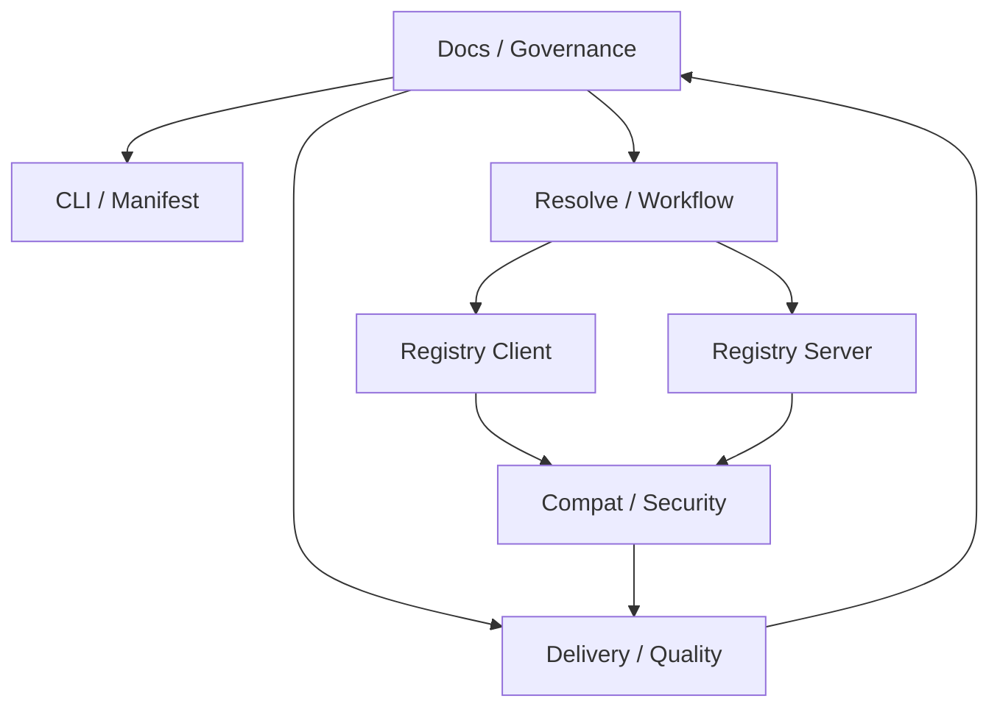

# spio Coordination Runbook

**Purpose:** Provide the daily coordination entrypoint for `spio` maintainers; this file keeps ownership, review routing, escalation, and checkpoint expectations explicit without replacing the owner documents.

**Last updated:** 2026-04-17

## Mission

The coordination owner keeps module ownership explicit, routes cross-team review, and prevents hidden dependencies on `styio` compiler internals or closed-source security code. This role does not redefine public contracts, policy, or gate commands.

Authoritative references:

1. Documentation ownership model: [../governance/Docs-Maintenance-Model.md](../governance/Docs-Maintenance-Model.md)
2. CLI and manifest policy: [../governance/Spio-CLI-Contract.md](../governance/Spio-CLI-Contract.md)
3. Registry layout and roles: [../governance/Spio-Registry-Repository-Contract.md](../governance/Spio-Registry-Repository-Contract.md)
4. Security boundary: [../security/Spio-Private-Security-Module-Contract.md](../security/Spio-Private-Security-Module-Contract.md)
5. Verification entrypoints: [../operations/Spio-Verification-Matrix.md](../operations/Spio-Verification-Matrix.md)
6. External compiler handoff: [../styio/Styio-External-Interface-Requirement-Spec.md](../styio/Styio-External-Interface-Requirement-Spec.md)
7. Cross-repo milestone mirror: [../planning/Styio-Ecosystem-Delivery-Master-Plan.md](../planning/Styio-Ecosystem-Delivery-Master-Plan.md)
8. File-governance alignment mirror: [../planning/Styio-Ecosystem-File-Governance-Alignment-Plan.md](../planning/Styio-Ecosystem-File-Governance-Alignment-Plan.md)

## Module Map

## Ownership Table

| Team | Primary runbook | Main surface | Required review trigger |
|------|-----------------|--------------|-------------------------|
| CLI / Manifest | [CLI-MANIFEST-RUNBOOK.md](./CLI-MANIFEST-RUNBOOK.md) | CLI flags, command shapes, manifest and lock semantics | CLI surface, exit code, manifest rule, or entry-argument change |
| Resolve / Workflow | [RESOLVE-WORKFLOW-RUNBOOK.md](./RESOLVE-WORKFLOW-RUNBOOK.md) | resolver, plan, workflow, graph, local orchestration | dependency graph, plan payload, resolver rule, or workflow status change |
| Registry Client | [REGISTRY-CLIENT-RUNBOOK.md](./REGISTRY-CLIENT-RUNBOOK.md) | read-side registry fetch, cache, extraction | client fetch path, cache layout, package materialization, or read protocol change |
| Registry Server | [REGISTRY-SERVER-RUNBOOK.md](./REGISTRY-SERVER-RUNBOOK.md) | publish-side registry write path and origin behavior | publish flow, immutable object layout, write origin, or promotion-path change |
| Compat / Security | [COMPAT-SECURITY-RUNBOOK.md](./COMPAT-SECURITY-RUNBOOK.md) | machine contracts, `styio` compatibility, public security boundary | compatibility phase, machine-info handshake, schema, or public security boundary change |
| Delivery / Quality | [DELIVERY-QUALITY-RUNBOOK.md](./DELIVERY-QUALITY-RUNBOOK.md) | tests, submit gate, performance baseline, export checks | gate profile, test fixture oracle, perf threshold, or delivery export shape change |
| Docs / Governance | [DOCS-GOVERNANCE-RUNBOOK.md](./DOCS-GOVERNANCE-RUNBOOK.md) | docs structure, ADRs, planning handoff, written contracts | SSOT owner change, doc topology change, planning boundary change, or split guidance change |

## Review Matrix

1. CLI and manifest changes require CLI / Manifest review, plus Resolve / Workflow when command output feeds plans or resolver state.
2. Resolver or workflow changes require Resolve / Workflow review, plus CLI / Manifest when user-facing command payloads move and Delivery / Quality when gates or fixtures change.
3. Registry client and registry server changes that touch shared object layout or transport expectations require both registry teams to review.
4. Any machine contract, compatibility phase, or `styio` handoff change requires Compat / Security and the directly affected consumer team to review.
5. Public security-boundary changes require Compat / Security and Docs / Governance review; private implementation policy must stay out of tracked sources.
6. Delivery profile, repo hygiene, perf baseline, or export-tree changes require Delivery / Quality review and the owning feature team for the affected surface.
7. Documentation structure or SSOT ownership changes require Docs / Governance review and the owning feature team whose daily workflow changes.

## Escalation Rules

1. CLI or manifest meaning conflict: use [../governance/Spio-CLI-Contract.md](../governance/Spio-CLI-Contract.md) and [../governance/Spio-Manifest-and-Lock-Conventions.md](../governance/Spio-Manifest-and-Lock-Conventions.md).
2. Registry role or object-layout conflict: use [../governance/Spio-Registry-Repository-Contract.md](../governance/Spio-Registry-Repository-Contract.md), then the owner doc under `../registry/`.
3. Public/private security conflict: use [../security/Spio-Private-Security-Module-Contract.md](../security/Spio-Private-Security-Module-Contract.md).
4. Verification or acceptance conflict: use [../operations/Spio-Verification-Matrix.md](../operations/Spio-Verification-Matrix.md).
5. External compiler boundary conflict: use [../styio/Styio-External-Interface-Requirement-Spec.md](../styio/Styio-External-Interface-Requirement-Spec.md) and [../styio/Styio-Public-Interface-Roadmap.md](../styio/Styio-Public-Interface-Roadmap.md).

## Checkpoint Policy

1. Keep high-risk work checkpoint-sized and mergeable inside one to three days.
2. Ship code, tests, owner docs, and ADR updates together when a public boundary or workflow rule changes.
3. Do not create hidden source-level dependencies on `styio` compiler files or on gitignored private security trees.
4. Update the affected team runbook whenever owned surfaces, review routes, or recovery steps change.
5. If a checkpoint changes cross-repo milestone IDs, repo exits, or compatibility cutover rules, update the authoritative nightly plan, this mirror plan, and the affected owner docs in the same batch.
6. If a checkpoint changes docs tree topology, index-generation, lifecycle, ignore-policy baseline, or tracked-fixture negate rules, update the authoritative nightly file-governance plan, this mirror, and the affected governance/operations/team docs in the same batch.
7. Run the smallest relevant team gate first, then the submit or release profile from [../operations/Spio-Verification-Matrix.md](../operations/Spio-Verification-Matrix.md).

## Release / Cutover Gates

| Cutover | Minimum gate |
|---------|--------------|
| CLI or manifest contract | `spio_cli_gate` plus relevant manifest or lock fixtures |
| Resolver or workflow behavior | `spio_manifest_lock_gate`, `spio_workflow_gate`, and affected integration fixtures |
| Registry client or server publish/fetch behavior | `spio_registry_server_gate` and any promotion or split-origin gate affected |
| External compiler handshake or schema | `styio_contract_compat_gate`, `styio_compile_plan_contract_gate`, and updated contract fixtures |
| Delivery export or repository hygiene | `quality_no_binaries_gate`, `quality_repo_hygiene_gate`, `delivery_package_gate`, and `spio_submit_gate` |

## Handoff / Recovery

1. Record interrupted work in the active section of [../planning/Spio-Workstreams-and-TODOs.md](../planning/Spio-Workstreams-and-TODOs.md) when it survives beyond one checkpoint.
2. List the exact owner documents touched, tests already run, and next blocking command.
3. Record rollback points for any CLI, registry, compatibility, or gate change.
4. If a dependency crosses into another team, split the remaining work into a visible follow-up instead of leaving an implicit note in code.
